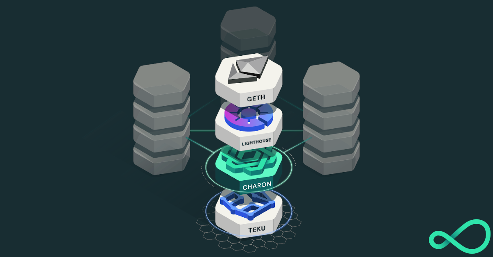

<h1 align="center">Charon Distributed Validator Node</h1>

This repo contains the [docker-compose](https://docs.docker.com/compose/) files needed to run one node in a [charon](https://github.com/ObolNetwork/charon) [Distributed Validator Cluster](https://docs.obol.tech/docs/int/key-concepts#distributed-validator-cluster).

A distributed validator node is a machine running:

- An Ethereum Execution client
- An Ethereum Consensus client
- An Ethereum Distributed Validator client
- An Ethereum Validator client

# Quickstart

Check the Obol [docs](https://docs.obol.tech/docs/int/quickstart) for detailed instructions on how to get started using this repo.

# Project Status

It is still early days for the Obol Network and everything is under active development.
It is NOT ready for mainnet.
Keep checking in for updates, [here](https://dvt.obol.tech/) is the latest on charon's supported clients and duties.

# FAQs

Check the Obol docs for frequent [errors and resolutions](https://docs.obol.tech/docs/int/faq/errors)
