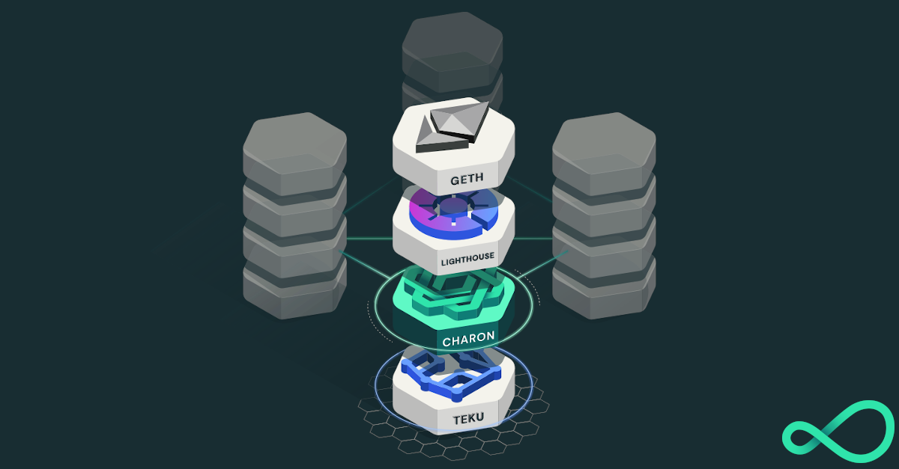

<h1 align="center">Charon Distributed Validator Node</h1>

This repo contains the [docker-compose](https://docs.docker.com/compose/) files needed to run one node in a [charon](https://github.com/ObolNetwork/charon) [Distributed Validator Cluster](https://docs.obol.tech/docs/int/key-concepts#distributed-validator-cluster).

A distributed validator node is a machine running:

- An Ethereum Execution client
- An Ethereum Consensus client
- An Ethereum Distributed Validator client
- An Ethereum Validator client



# Quickstart

Check the Obol [docs](https://docs.obol.tech/docs/start/quickstart_overview) for detailed instructions on how to get started using this repo.

# Examples

A default example configuration of a full validator node is found in the root `docker-compose.yml` file.

⚠️⚠️⚠️ **Important:**
The configurations provided are meant for demonstration purposes only and may not be suitable for production environments.
These examples are primarily intended for advanced users who are familiar with Docker and have a good understanding of execution and consensus clients.
Please exercise caution when using them and ensure that you thoroughly review and customize the configurations according to your specific requirements.

To run the default example, use the following command:

```sh
docker compose up
```

# Multi-client CDVN

Default CDVN is available with the following stack:

- Execution layer: Nethermind
- Consensus layer: Lighthouse
- Distributed validator: Charon
- Validator cllient: Lodestar
- MEV: MEV-boost

Our focus at Obol being decentralisation, CDVN can also run with multiple clients. We will slowly be rolling out support for different EL, CL, VC and MEV clients.

## Migrating as an existing CDVN user

In order to migrate a currently running Nethermind-Lighthouse-Charon-Lodestar-MEVBoost setup to multi-client one, the `.env` should be updated.

1. Copy the new `.env.sample.<NETWORK>` file to `.env`. Make sure custom environment variables are not lost in the process.

  > [!IMPORTANT]  
  > Some environment variables were renamed in order to be client-agnostic. If you have set those environment variables to custom values, after migrating to the multi client setup, use the new ones. They serve the same purpose.
  >
  > | Old                           | New                              |
  > |-------------------------------|--------------------------------- |
  > | NETHERMIND_PORT_P2P           | EL_PORT_P2P                      |
  > | NETHERMIND_IP_HTTP            | EL_IP_HTTP                       |
  > | NETHERMIND_PORT_HTTP          | EL_PORT_HTTP                     |
  > | NETHERMIND_IP_ENGINE          | EL_IP_ENGINE                     |
  > | NETHERMIND_PORT_ENGINE        | EL_PORT_ENGINE                   |
  > | LIGHTHOUSE_PORT_P2P           | CL_PORT_P2P                      |
  > | LODESTAR_PORT_METRICS         | VC_PORT_METRICS                  |
  > | MEVBOOST_TIMEOUT_GETHEADER    | MEV_TIMEOUT_GETHEADER            |
  > | MEVBOOST_TIMEOUT_GETPAYLOAD   | MEV_TIMEOUT_GETPAYLOAD           |
  > | MEVBOOST_TIMEOUT_REGVAL       | MEV_TIMEOUT_REGVAL               |
  > | MEVBOOST_RELAYS               | MEV_RELAYS                       |
  > | NETHERMIND_PROMTAIL_MONITORED | EL_NETHERMIND_PROMTAIL_MONITORED |
  > | LIGHTHOUSE_PROMTAIL_MONITORED | CL_LIGHTHOUSE_PROMTAIL_MONITORED |
  > | LODESTAR_PROMTAIL_MONITORED   | VC_LODESTAR_PROMTAIL_MONITORED   |
  > | MEV_BOOST_PROMTAIL_MONITORED  | MEV_MEV_BOOST_PROMTAIL_MONITORED |

2. Stop the existing cluster.

```sh
docker compose --profile "" down
```

3. Start the new cluster.

```sh
docker compose up -d
```

## Switch consensus layer client

1. Stop the existing consensus layer client container.
> [!TIP]
> If you do not want to experience downtime while the new beacon node is syncing, you can set a fallback beacon node for Charon (`CHARON_FALLBACK_BEACON_NODE_ENDPOINTS` env variable) that will be used while the new BN is syncing.

```sh
docker compose down cl-lighthouse
```

2. Update the `CL` environment variable to a different supported consensus layer client (i.e.: `cl-grandine`). In the `.env` are listed the currently supported clients.

3. Start the new consensus layer client container.

```sh
docker compose up cl-grandine -d
```

4. Restart Charon in order to update the BN it's querying.

```sh
docker compose down charon
docker compose up charon -d
```

5. After the new beacon node is synced and you are assured the new setup is working, you can delete the previous BN's data in order to save resources

```sh
rm -rf ./data/lighthouse
```

## Switch validator client

1. Stop the existing validator client container.

```sh
docker compose down vc-lodestar
```

2. Update the `VC` environment variable to a different supported validator client (i.e.: `vc-nimbus`). In the `.env` are listed the currently supported clients.

3. Start the new validator client container.

```sh
docker compose up vc-nimbus -d
```

4. After the new validator client is started and you are assured the new setup is working, you can delete the previous VC's data in order to save resources

```sh
rm -rf ./data/lodestar
```

## Switch MEV client

0. If switching to commit-boost, you will need to copy a commit-boost TOML config `commit-boost/config.toml.sample.<NETWORK>` to `commit-boost/config.toml` , as it does not support `.env` configurations yet. Make sure the configuration matches what you have had set for mev-boost, in terms of relays and timeouts.

1. Stop the existing MEV client container.

```sh
docker compose down mev-mevboost
```

2. Update the `MEV` environment variable to a different supported MEV client (i.e.: `mev-commitboost`). In the `.env` are listed the currently supported clients.

3. Start the new MEV client container.

```sh
docker compose up mev-commitboost -d
```

4. Restart the beacon node in order to update the MEV it's querying.

```sh
docker compose down cl-grandine
docker compose up cl-grandine -d
```

# FAQs

Check the Obol docs for frequent [errors and resolutions](https://docs.obol.tech/docs/faq/errors)
